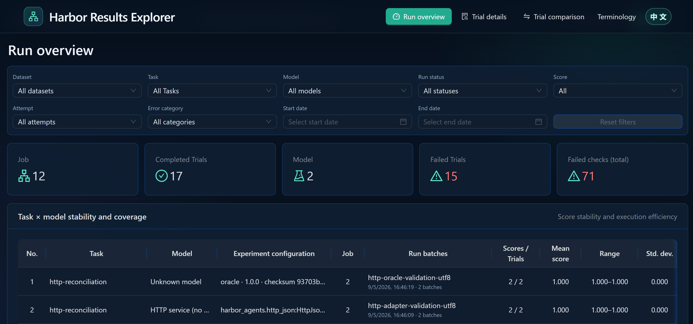
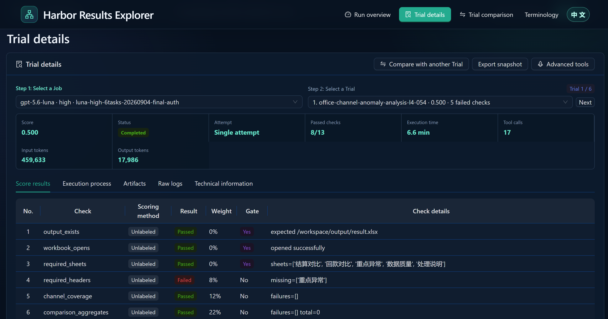

# AI Business Evals

> A framework for evaluating business outcomes across AI systems.

[中文](README.md) | English

This repository is an **AI-era business-outcome evaluation method and starter kit**. It helps teams turn real work into repeatable evaluation tasks with verifiable results and evidence that explains failures.

The subject under evaluation may be an AI Agent that completes work directly, or an application, algorithm, or workflow exposed over HTTP.

The repository includes six Office Agent Tasks and one HTTP reconciliation Task as reference examples, plus an independent [public Office / workplace benchmark index](docs/office-benchmarks.en.md). Use them to learn the complete flow, then adapt the Task to your own domain.

[Quick start](#quick-start) · [Customize a business scenario](#customize-a-business-scenario) · [Boundaries](#boundaries) · [Documentation](#documentation)

## Background

As AI models, applications, and Agents continue to proliferate, more business ideas can quickly become runnable solutions. The challenge therefore moves beyond “can we build it?” to “which solution should we choose, did it do the right thing, will it remain stable, and is the next release still reliable?”.

Runnable does not mean business-compliant, and one successful run does not prove sustained reliability. Different implementations need to be accepted against business rules; upgrades need regression checks; and exceptional or high-risk cases need targeted tests. **Repeatable evaluations grounded in real work and backed by reviewable evidence are becoming a core safeguard for reliable delivery and operation.**

## Why this project matters

1. **Verify that a business solution is actually usable**

   Do not stop at a plausible answer, a generated file, or a successful HTTP response: check completeness, calculations, and exception handling so release decisions have evidence.

2. **Compare implementations and versions**

   Hold business inputs, acceptance rules, and runtime conditions constant while comparing result quality and validating upgrades. The HTTP reconciliation example runs both an HTTP service and a local reference implementation (oracle) through the same verifier, showing how different implementations can share one business contract.

3. **Lower the cost of starting a custom evaluation**

   The repository provides Task structure, execution adapters, input packaging, reference facts, positive/negative scoring fixtures, and result-analysis tools. Teams mainly customize business inputs, invocation, and acceptance rules; unusual requirements can stay local to the relevant Task and adapter.

For Agent evaluations, component scores, deliverables, and execution trajectories also support model selection and process diagnosis. Once a workflow is mature, authorized successful trajectories, corrected failures, and preference pairs can feed distillation or post-training, consolidating suitable capabilities into specialized small models. Keep an independent evaluation set close to the target business distribution to validate capabilities, regressions, and boundaries, and to inform the division of work between frontier models and specialized models.

## Workflow and responsibilities

```text
Define business inputs and acceptance rules → Execute with Harbor → Verify business results → Review evidence and compare versions
```

- **Harbor** manages task execution, environments, and Job / Trial records.
- **This project** provides adaptable scenario examples, an HTTP execution adapter, scoring examples, and result-analysis tools.
- **The business owner** defines inputs and acceptance rules and adapts environments, field mappings, and checks as needed.

## Quick start

| Path | Prerequisites | Entry point and expected result |
| --- | --- | --- |
| HTTP application / algorithm | Python, uv, a running Docker daemon; the local teaching service needs no model account | Follow [HTTP quick start](docs/harbor/http-evaluation.en.md) to run HTTP and oracle implementations. Both should pass the same verifier and produce response JSON, call logs, and component scores. |
| Office Agent | Harbor, a running Docker daemon, and credentials for the selected Agent | Follow the [Office workflow](docs/harbor/workflow.en.md#4-run-one-or-more-models) for the six examples. You will get Office deliverables, component scores, and (where supported) trajectories; scores depend on the Agent. |

The Tasks live under the [HTTP examples](examples/harbor-http-tasks/README.en.md) and [Office examples](examples/harbor-office-tasks/README.en.md). When connecting your own HTTP service, authentication and dependencies are service-specific.

### Review results

Run records are stored in `harbor-jobs` by default. Windows users can double-click [start-trajectory-portal.bat](start-trajectory-portal.bat), or run:

```powershell
.\scripts\start-trajectory-portal.ps1
```

Linux / macOS:

```bash
./scripts/start-trajectory-portal.sh
```

[The Portal](tools/trajectory-portal/README.en.md) (this project’s run-results analysis and inspection interface) provides run overview, single-Trial review, multi-Trial comparison, and deep two-Trial comparison. It can open Harbor Viewer, RLViz, and AgentViz. HTTP examples show the response and call log; they do not produce model conversation trajectories.

### Portal at a glance

<p align="center">
  
  
</p>

## Customize a business scenario

Copy the closest example Task. First write down what passes and what must fail, then change three areas:

1. **Inputs and environment**: replace business data, prepare required tools or test state, and define the input distribution and runtime conditions.
2. **Execution adapter**: select an existing Agent, or change the HTTP endpoint and request/response mapping.
3. **Business acceptance**: implement the checks and add both expected-good and representative-bad results to test the verifier itself.

Run one complete Task before adding more cases and comparing versions. See the [Task creation guide](docs/harbor/creating-task.en.md) for Office work and [HTTP integration](docs/harbor/http-evaluation.en.md#customize-three-parts) for services. There is no need to design a universal protocol or a complex plugin system first.

## Boundaries

- **Examples are not a formal benchmark**: the six Office Tasks and one HTTP Task are public teaching examples, not complete business coverage. Their verifiers are not universal acceptance engines for other domains.
- **HTTP integration is intentionally small**: the reference adapter supports synchronous JSON POST request/response. Async jobs, special authentication, and stateful workflows require a scenario-specific adapter.
- **Comparability requires controlled conditions**: align output semantics and the boundaries for time and cost. Local Harbor does not automatically reset or isolate remote service state and dependencies.
- **Reliability requires representative tests**: cover common, exceptional, and high-risk cases; for Agents, consider the mix of operation types. Separate development tasks from hidden test tasks when making selection or release decisions.
- **Evaluation is not production assurance**: offline success does not guarantee real-world value and does not replace access control, monitoring, or recovery testing.

## Documentation

| Goal | Documents |
| --- | --- |
| Understand Harbor objects and execution | [Task, Dataset, Job, Trial, results, and trajectories](docs/harbor/architecture.en.md) |
| Create and run Office Tasks | [Task creation](docs/harbor/creating-task.en.md) · [Workflow](docs/harbor/workflow.en.md) · [Weekly ticket case study](docs/harbor/ticket-weekly-case-study.en.md) |
| Connect an HTTP application or algorithm | [Run and customize](docs/harbor/http-evaluation.en.md) · [Adapter notes](harbor_agents/README.en.md) |
| Design and inspect scoring | [Scoring design and positive/negative regression](docs/harbor/scoring-design.en.md) |
| Review results and locate process differences | [Portal](tools/trajectory-portal/README.en.md) · [Trajectory comparison](docs/harbor/trajectory-comparison.en.md) |
| Browse public Office benchmarks | [Full index](docs/office-benchmarks.en.md) |

The benchmark index tracks distribution, availability, sources, and licenses separately. It remains an Office / workplace Agent index and does not limit the custom scenarios this repository can support. An external benchmark listed there is not automatically runnable from this repository.

## License

The repository’s code and documentation are licensed under [Apache-2.0](LICENSE). Sources and license boundaries for adapted Office examples and the original HTTP example are recorded in [NOTICE.md](NOTICE.en.md); public download does not imply unrestricted redistribution.
